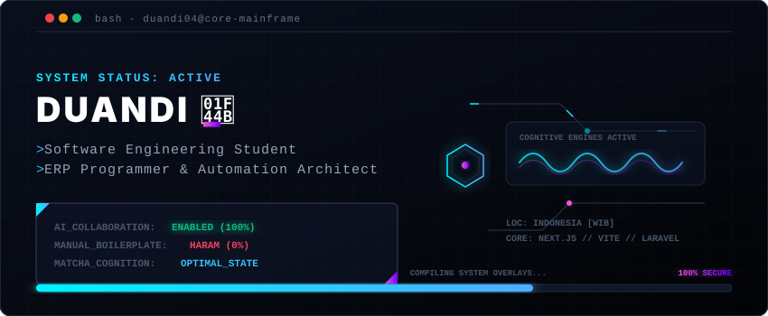
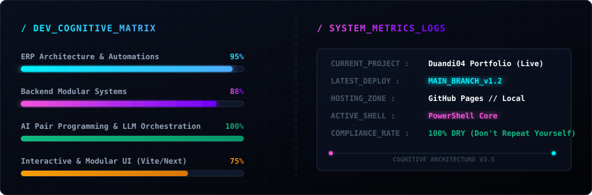

<p align="center">
  
</p>

<div align="center">
  <h3>⚡ Software Engineer & ERP Programmer ⚡</h3>
  <p>Mahasiswa Software Engineering di Universitas Universal (UVERS) & ERP Programmer di Tigernix Pte. Ltd.</p>
</div>

---

### 🖥️ SYSTEM TERMINAL

```bash
$ systemctl status duandi.service
● duandi.service - Software Engineering & ERP Development Cognitive Engine
     Loaded: loaded (/etc/systemd/system/duandi.service; enabled)
     Active: active (running) since Wed 2022-09-01 08:00:00 WIB (Uptime: 3+ years)
     Main PID: 10340 (powershell.exe)
     Status: "Matcha level nominal. Designing complex backend logics... 🍵"
```

### 🧠 ABOUT THE COGNITIVE ENGINE

Saya adalah mahasiswa Software Engineering di Universitas Universal (UVERS) yang saat ini bekerja sebagai ERP Programmer di Tigernix Pte. Ltd. Sebagai seorang programmer, saya memiliki ketertarikan kuat pada ranah backend dan logika. Saat ini saya sedang dalam masa penyusunan tugas akhir skripsi dan berfokus mengembangkan OmniLife Super App. Di luar waktu coding, saya menikmati membaca webtoon, bermain game (Steam, mobile defense, Minecraft), mengeksplorasi kafe-kafe, dan mendengarkan musik Jepang.

---

### 🚀 CORE DIRECTIVES & MISSION CRITICALS

```diff
+ 🌐 Backend Architecture & Relational Databases
  Designing scalable, decoupled backend service layers and bulletproof modular databases.

+ 📊 Enterprise ERP Engineering
  Formulating robust business logic, tenancy agreements, and automated reconciliation systems.

+ 📱 Native Mobile & Modern Web
  Building high-fidelity offline-first SQLite mobile apps and responsive web interfaces.

+ ⚡ Hyper-Automation Systems & AI Synergy
  Developing automated shell scripts and leveraging advanced AI engines to maximize velocity.
```

---

### 🛠️ COGNITIVE TECH STACKS

<div align="center">

| Category | Technologies & Tools |
| :--- | :--- |
| **Backend & Logic** |     |
| **Mobile & Web** |      |
| **Tools & Ecosystem** |      |

</div>

---

### 📊 DEV METRICS & SYSTEM TELEMETRY

<p align="center">
  
</p>

<p align="center">
  
</p>

---

### ⚡ LATEST BUILD DIAGNOSTICS

```bash
$ npm run build --project=duandi-portfolio

> duandi-portfolio@1.2.0 build
> vite build

✓ 48 files transformed.
rendering chunks...
✓ built in 1.48s

[SUCCESS] Deployment uploaded to production mainframe.
[INFO] Active modules: Backend, ERP, Mobile, Web Automation.
[STATUS] 0 errors, 0 warnings.
```

---

### ☕ terminal --show-fun-facts

```bash
$ cat ~/.config/duandi/fun-facts.json
{
  "insights": "Kebanyakan dapet ide brilian buat fix bug pas lagi bengong di kafe sambil minum matcha latte 🍵",
  "tolerance": "Punya toleransi yang tinggi sama error log Sentry, asal ujung-ujungnya berakhir 'Resolved' ✔️",
  "overthinking": "Overthinking adalah hobi, tapi kalau disalurkan ke arsitektur kode malah jadi fitur premium 🚀"
}
```

---

### 🌐 NETWORK ENDPOINTS (CONTACT)

```bash
$ ping -c 4 duandi.network
PING duandi.network (10.0.4.22) 56(84) bytes of data.
--- duandi.network connection established ---
📧 Email     :: duandiduan22@gmail.com
🐙 GitHub    :: https://github.com/Duandi04
💼 LinkedIn  :: https://linkedin.com/in/duandi-55b168354/
📸 Instagram :: https://instagram.com/duandiduan/
```

<div align="center">
  <a href="mailto:duandiduan22@gmail.com">
    
  </a>
  <a href="https://github.com/Duandi04">
    
  </a>
  <a href="https://www.linkedin.com/in/duandi-55b168354/">
    
  </a>
  <a href="https://www.instagram.com/duandiduan/">
    
  </a>
</div>

---

<p align="center">
  <i>"Talk is cheap. Show me the code... or let the AI generate the boilerplate first."</i>
</p>